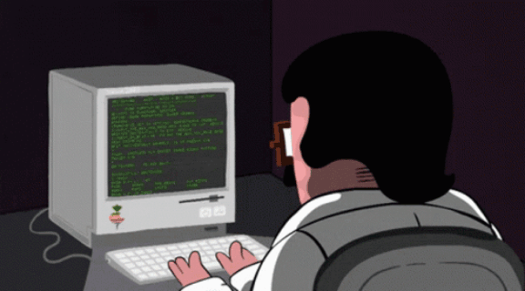

## Hi there , I am Anshuman

- 👨🏻‍🎓 Undergrad at Amrita Vishwa Vidyapeetham, Amritapuri.
- 👨🏻‍💻 Member at [amFoss](https://amfoss.in/)
- 🦾 Working on Machine Learning and Artificial Intelligence.
- 🚀 Full Stack Web Developer.
- 🛠️ Always building 

<h3>🙋‍♂️ Let's Connect</h3>

  
        
        
        
        
        

<!-- Footer -->

<!--   

  
  
 -->
<!--   
 -->
<!--     ════ ⋆★⋆ ════ -->
<!--           -->
<!--          Happy Coding👨‍💻! -->
<!--          
    
 -->

